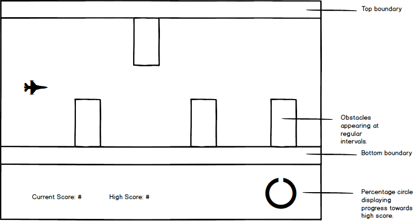

# Helicopter with Extras

## Background

I would like to develop a version of the popular flash game [helicopter](http://www.play-helicopter-game.com/).  Upon clicking a 'start' button on the splash page, the user will be presented with a descending helicopter (time permitting, this will be somehow animated) that they must navigate past obstacles that scroll in from stage right.  Their only means to to this will be the mouse click, which will 'power' the helicopter and counter the effects of gravity.  As the game progresses, the user will accumulate points, and as an added bonus, I would also like to keep track of the user's progress towards their current high score by means of a simple canvas percentage circle.  Many players keep playing in hopes of beating their last high score, and I believe that a simple animation like this will provide some added incentive.

## Functionality & MVP

In this version of helicopter, users will be able to:

- [ ] Start the game by clicking on the splash-page
- [ ] Navigate their helicopter (or similar) past obstacles by counteracting  gravity
- [ ] Accrue points, with the game keeping track of their high score
- [ ] During gameplay, observe their current point total as a percentage of their high score by means of a canvas percentage circle.

## Wireframe

Below is an example of the game in progress.  The initial screen will be similar, but instead of the plane and obstacles, the screen will display "Click to Start...and keep clicking!"

## Architecture and Technologies

* Vanilla JS and Jquery for structure and logic
* Webpack to supply the various scripts
* Canvas for the percentage circle and (if it seems necessary) Easel.js to help rendering it

### Scripts Involved

* Board.js: Will handle board logic, including keeping a running total of the high score, and will restart the game when a collision occurs
* Obstacles.js: Will handle the production and propagation of (pseudo)-randomly sized obstacles
* Helicopter.js: Will handle flight logic and mouse clicks
* Circle.js: Will handle the percentage circle, resetting to zero on gameover

## Implementation Timeline

**Day 1**: Re-familiarize myself with Vanilla JS.  Write webpack, index file, and develop a more through outline of the logic required for the scripts to render appropriately.

**Day 2**: Develop a working board that scrolls and produces obstacles of a type that a helicopter could avoid.  Begin writing flight logic.

**Day 3**: Incorporate helicopter into the game and begin work on translating current score into canvas percentage circle.

**Day 4**: Styling! Time permitting, this will also include animation of the helicopter, a trail left behind it, and various types of obstacles.  
